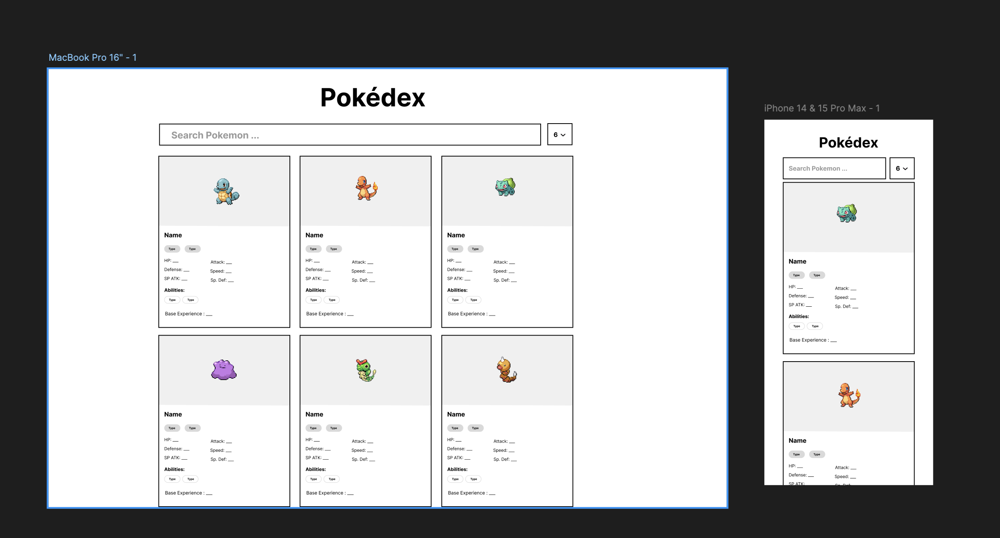

# PokeDex

An app that uses the [https://pokeapi.co/](https://pokeapi.co/) api to search through pokemons and get information about it.

## Check out on Vercel

Check out my application on [https://pokedex.zachuri.com/](https://pokedex.zachuri.com/)

## Getting Started

To run this application locally, run the development server:

```bash
npm run dev
# or
yarn dev
# or
pnpm dev
# or
bun dev
```

Open [http://localhost:3000](http://localhost:3000) with your browser to see the result.

## Tech Stack

- Next.js
- Tailwind CSS
- Shadcn UI
- Zustand
- Figma for Designs

## Features

- Search through a list of pokemons fetched from [https://pokeapi.co/](https://pokeapi.co/)
- Limit the amount of pokemons displayed
- Pagination through all the fetched pokemons
- Dynamic Routes E.g) `/pokemon/<pokemon id or name>`
  - Click on pokemon from home page and redirects to the dynamic route
- Loading Skeletons for loading states
- Error Handling for error states

## Main Files to Look at

- `src/app/page.tsx`
- `src/components/Pokemons.tsx`
- `src/app/pokemon/[id]/page.tsx`

## Mock up Designs


